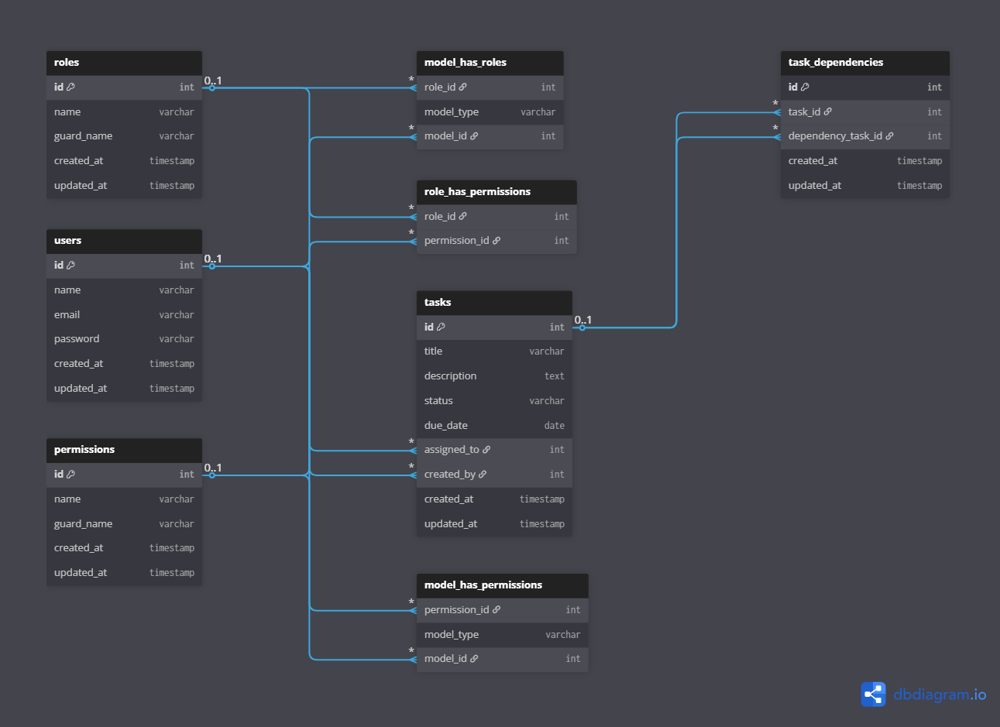

# Task Management API

A robust RESTful API for task management with role-based access control, built with Laravel 12 and JWT authentication.


## Overview

This API allows managers and users to manage tasks with features like:

- Task creation, update
- Assigning tasks to users
- Task dependencies (cannot complete tasks until dependencies are completed)
- Role-based access control (Managers vs Users)
- Filtering tasks by status, due date, and assignee

---

## Features

- **JWT Authentication** - Stateless authentication with token refresh
- **Role-Based Access Control** - Managers and Users with different permissions
- **Task Management** - Full CRUD operations with filtering
- **Task Dependencies** - Prevent task completion until dependencies are met
- **Input Validation** - Comprehensive request validation
- **Error Handling** - Consistent API error responses
- **Rate Limiting** - Built-in protection against abuse
- **Docker Support** - Ready for containerization

## Requirements

- PHP 8.2+
- Composer
- MySQL 8.0+


## Installation

### Using Composer (Traditional)

```bash
# Clone the repository
git clone <repository-url>
cd task-management

# Install dependencies
composer install

# Copy environment file
cp .env.example .env

# Generate application key
php artisan key:generate

# Generate JWT secret
php artisan jwt:secret

# Run migrations
php artisan migrate

# Seed the database
php artisan db:seed

# Start the server
php artisan serve
```

### Using Docker

```bash
# Clone the repository
git clone <repository-url>
cd task-management

# Start containers
docker-compose up -d

# Install dependencies (first time only)
docker-compose exec app composer install

# Generate application key
docker-compose exec app php artisan key:generate

# Generate JWT secret
docker-compose exec app php artisan jwt:secret

# Run migrations
docker-compose exec app php artisan migrate

# Seed the database
docker-compose exec app php artisan db:seed
```

The API will be available at `http://localhost:8000`

## API Documentation

Postman Collection

Open all endpoints directly via Postman: [Postman Collection](https://documenter.getpostman.com/view/27854125/2sB3HtFGYx)


## Routes & Example Requests

### Authentication

| Method | Endpoint | Example Request | Example Response |
|--------|----------|----------------|----------------|
| POST   | `/api/login` | `{ "email": "manager@example.com", "password": "password" }` | `{ "data": { "access_token": "...", "token_type": "bearer", "expires_in": 3600 }, "message": "Login successful" }` |
| GET    | `/api/me` | `Authorization: Bearer {token}` | `{ "data": { "id": 1, "name": "Manager", "email": "manager@example.com", "role": "Manager" } }` |
| POST   | `/api/logout` | `Authorization: Bearer {token}` | `{ "message": "Successfully logged out" }` |
| POST   | `/api/refresh` | `Authorization: Bearer {token}` | `{ "data": { "access_token": "...", "token_type": "bearer", "expires_in": 3600 }, "message": "Token refreshed" }` |

---

### Tasks (Requires Authentication)

| Method | Endpoint | Example Request | Example Response |
|--------|----------|----------------|----------------|
| GET    | `/api/tasks` | `Authorization: Bearer {token}` | `[ { "id": 1, "title": "Task 1", "status": "pending", "assigned_to": 2, "dependencies": [] } ]` |
| POST   | `/api/tasks` | `{ "title": "New Task", "description": "Task desc", "due_date": "2024-12-31", "assigned_to": 2 }` | `{ "message": "Task created successfully", "data": { "id": 3, "title": "New Task" } }` |
| GET    | `/api/tasks/{task}` | `Authorization: Bearer {token}` | `{ "id": 3, "title": "New Task", "status": "pending", "assigned_to": 2, "dependencies": [] }` |
| PUT/PATCH | `/api/tasks/{task}` | `{ "title": "Updated Task", "status": "in_progress" }` | `{ "message": "Task updated successfully", "data": { "id": 3, "title": "Updated Task" } }` |
| POST   | `/api/tasks/{task}/assign` | `{ "user_id": 3 }` | `{ "message": "Task assigned successfully" }` |
| POST   | `/api/tasks/{task}/dependencies` | `{ "dependency_id": 5 }` | `{ "message": "Dependency added successfully" }` |
| DELETE | `/api/tasks/{task}/dependencies` | `{ "dependency_id": 5 }` | `{ "message": "Dependency removed successfully" }` |


## Role-Based Access Control

### Manager Permissions
-  Create, read, update all tasks
-  Assign tasks to users
-  Manage task dependencies
-  View all tasks with filtering

### User Permissions
-  View only assigned tasks
-  Update only status of assigned tasks
-  Cannot complete tasks with incomplete dependencies

## Default Users

The system comes with pre-seeded users:

| Email | Password | Role |
|-------|----------|------|
| manager@example.com | password | Manager |
| user@example.com | password | User |
| user2@example.com | password | User |


## Database Schema & ERD

### Tasks Table
- `id` - Primary key
- `title` - Task title (required, max 255 chars)
- `description` - Task description (max 1000 chars)
- `status` - pending, in_progress, completed, cancelled
- `due_date` - Due date
- `assigned_to` - Foreign key to users table
- `created_by` - Foreign key to users table
- `created_at`, `updated_at` - Timestamps

### Task Dependencies Table
- `id` - Primary key
- `task_id` - Foreign key to tasks table
- `dependency_task_id` - Foreign key to tasks table
- `created_at`, `updated_at` - Timestamps

Purpose: Enforces task dependencies, preventing completion until all dependencies are completed.

ERD




## Error Responses

All error responses follow a consistent format:

```json
{
    "message": "Error description",
    "errors": {
        "field": ["Validation error message"]
    }
}
```

**Common HTTP Status Codes:**
- `200` - Success
- `201` - Created
- `401` - Unauthorized
- `403` - Forbidden
- `404` - Not Found
- `422` - Validation Error
- `429` - Too Many Requests
- `500` - Internal Server Error

## Rate Limiting

- **Login endpoint:** 5 requests per minute
- **Other endpoints:** 60 requests per minute


## Testing

```bash
# Run tests
php artisan test

# Run tests with coverage
php artisan test --coverage
```

## Security Features

- JWT token authentication
- Role-based access control
- Input validation and sanitization
- Rate limiting
- CORS headers
- Security headers (XSS protection, content type options)
- SQL injection protection (Eloquent ORM)
- CSRF protection (API routes exempt)

## Contributing

1. Fork the repository
2. Create a feature branch
3. Make your changes
4. Add tests
5. Submit a pull request

## License

This project is open-sourced software licensed under the [MIT license](https://opensource.org/licenses/MIT).